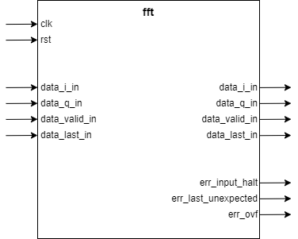

---
title: FFT IP 产品手册
author: Niantong Du
date: 2022年7月1日
...

# 基本信息

## 介绍

FFT IP 是一个 Cooley-Tukey 快速傅里叶变换（Fast Fourier Transform/FFT）算法的 HDL 实现。Cooley-Tukey 算法是一种计算离散傅里叶变换（Discrete Fourier Transform/DFT）的快速算法。

## 基本功能

- 可选的计算快速傅里叶变换或者其逆变换
- 可处理数据长度（FFT 长度） $N$ 满足 $N=2^m, m = 3 \sim 16$
- 输入数据位宽 $b_x$ 满足 $b_x = 8 \sim 34$
- 输出数据位宽 $b_y$ 满足 $b_x = 8 \sim 34$ (取决于输入位宽与 FFT 长度)
- 旋转因子位宽 $b_w$ 满足 $b_x = 8 \sim 34$
- 可选的自然序或者 Bit 逆序（Bit Reversed Order）输出

# IP 规格

## 概览

FFT IP 可用于计算长度为 $N$ 的序列 ${x_n, n=0,1,...,N-1}$ 的离散傅里叶变换（DFT）或者离散傅里叶逆变换（IDFT）。离散傅里叶变换定义为：

$$
X(k) = \sum_{n=0}^{N-1}{x(n) e^{-jnk2\pi/N}}, k=0,1,...,N-1
$$

其逆变换定义为：

$$
x(n) = \frac{1}{N} \sum_{k=0}^{N-1}{X(k) e^{-jnk2\pi/N}}, n=0,1,...,N-1
$$

FFT IP 在计算离散傅里叶逆变换时会忽略 $1/N$ 的常数因子。如果需要，用户可以对于输出数据自行进行缩放。

内部实现时，IP 采用了基 2 频率抽取（Radix-2，Decimation-in-Frequency/DIF）算法。算法要求序列长度 $N$ 需要满足 $2^m$ 的形式。即序列长度必须为 2 的整数次幂。$m$ 的取值范围为 $m = 3\sim 16$。

IP 的输入与输出数据都采用有符号定点数，并且为复数。定点数为二进制补码格式。输入数据的实部和虚部位宽一致，为 $b_x$。取值范围 $b_x = 8 \sim 34$。输出数据的实部和虚部位宽为 $b_y$ ，取值范围取决于输入数据位宽和 FFT 长度，同时满足 $b_y = 8 \sim 34$。FFT IP 内部的旋转因子位宽 $b_w$ 也满足 $b_x = 8 \sim 34$。

需要注意的是 FFT IP 输出数据可以是纯实数（将虚部置为 0 即可）。而输出是否为纯实数取决于 DFT 本身的性质。

基 2 频率抽取要求输入序列采用自然序输入，直接输出时为 Bit 逆序输出。IP 可选增加额外的模块将输出转换为自然序输出（需要额外资源）。

## 参数

| 参数                | 类型 | 详细描述                                        |
|---------------------|------|-------------------------------------------------|
| `FFT_SIZE`          | 整数 | FFT 序列长度 $N$                                |
| `INPUT_DATA_WIDTH`  | 整数 | 输入数据位宽 $b_x$                              |
| `PHASE_WIDTH`       | 整数 | 旋转因子位宽 $b_w$                              |
| `OUTPUT_DATA_WIDTH` | 整数 | 输出数据位宽 $b_y$                              |
| `HAS_BITREVERSE`    | 布尔 | 是否包含一个可选的 Bit 逆序模块，用以将逆序输出 |
|                     |      | 转换为自然序输出                                |

## 接口

下图展示了 FFT IP 的输入输出接口

### 时钟与复位接口

| 接口   | I/O | 详细描述          |
|--------|-----|-------------------|
| `clk`  | I   | IP 主时钟         |
| `rst`  | I   | IP 主复位，高有效 |

### 数据输入接口

| 接口            | I/O | 详细描述                                             |
|-----------------|-----|------------------------------------------------------|
| `data_i_in`     | I   | 输入数据的实部                                       |
| `data_q_in`     | I   | 输入数据的虚部                                       |
| `data_valid_in` | I   | 输入数据有效指示信号。用户需要连续输入序列的 $N$ 个  |
|                 |     | 采样点，即 `data_valid_in` 需要保持连续 $N$ 个时钟周 |
|                 |     | 期，中途不可置低                                     |
| `data_last_in`  | I   | 最后一组输入数据指示信号，用于指示长度为 $N$ 的序列  |
|                 |     | 中的最后一个采样点                                   |

### 数据输出接口

| 接口             | I/O | 详细描述                                            |
|------------------|-----|-----------------------------------------------------|
| `data_i_out`     | O   | 输出数据的实部                                      |
| `data_q_out`     | O   | 输出数据的虚部                                      |
| `data_valid_out` | O   | 输出数据有效指示信号。IP 会连续输出序列的 $N$ 个采  |
|                  |     | 样点，即 `data_valid_out` 会连续保持 $N$ 个时钟周期 |
|                  |     | 为高，中途不会置低                                  |
| `data_last_out`  | O   | 最后一组输出数据指示信号，用于指示长度为 $N$ 的序列 |
|                  |     | 中的最后一个采样点                                  |

### 控制与状态接口

| 接口                  | I/O | 详细描述                                            |
|-----------------------|-----|-----------------------------------------------------|
| `err_input_halt`      | O   | 用于指示输入信号不连续                              |
| `err_last_unexpected` | O   | 指示 `data_last_in` 没有出现在最后一个采样点位置    |
| `err_ovf`             | O   | 用于指示 FFT 运算中出现了溢出错误                   |

# IP 使用

## 时钟

IP 只使用了唯一一个时钟 `clk`，所有的输入输出信号都在这个时钟域内。

## 复位

IP 使用唯一一个复位信号 `rst`，当其为高时，内部的所有逻辑将会被复位到初始状态。`rst` 信号至少需要保证持续 16 个时钟周期以保证所有的内部逻辑都已经被正常复位。

# Test Bench
