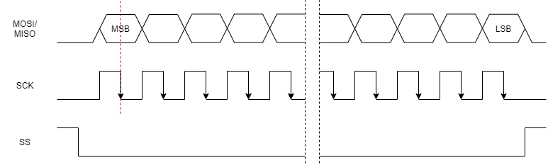

# JZL009-2

1588 核心板项目 FPGA 接口文档

## 目录

[TOC]

## 寄存器访问

MCU 至 FPGA 的寄存器访问通过一组 4 线 SPI 和一个中断引脚来完成。连接关系如下图所示：

目前 IRQ 管脚暂无功能，仅保留为后续扩展使用。

SPI 时序如下图所示：

Fsck 频率应小于 60MHz，占空比 50%。MCU 应配置为在 SCK 上升沿时输出数据，FPGA 将在时钟下降沿时进行采样。CPHA=1。

